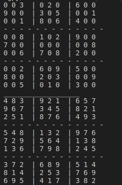
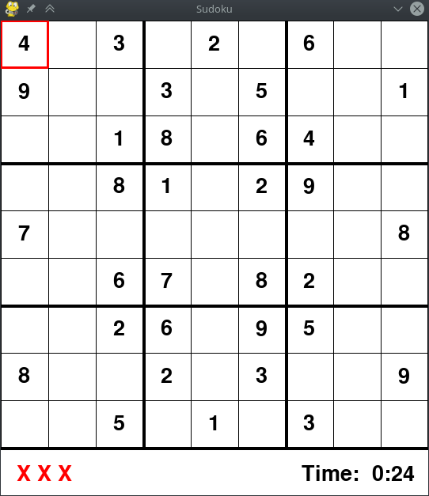

# Soduku-in-Python

you can input any puzzle like formate in (input.txt) and solve them by terminal  shhow imag 1
and print output in file (output.txt) 

and also in GUI.py can play game in gui as input in file  show imag2
  

